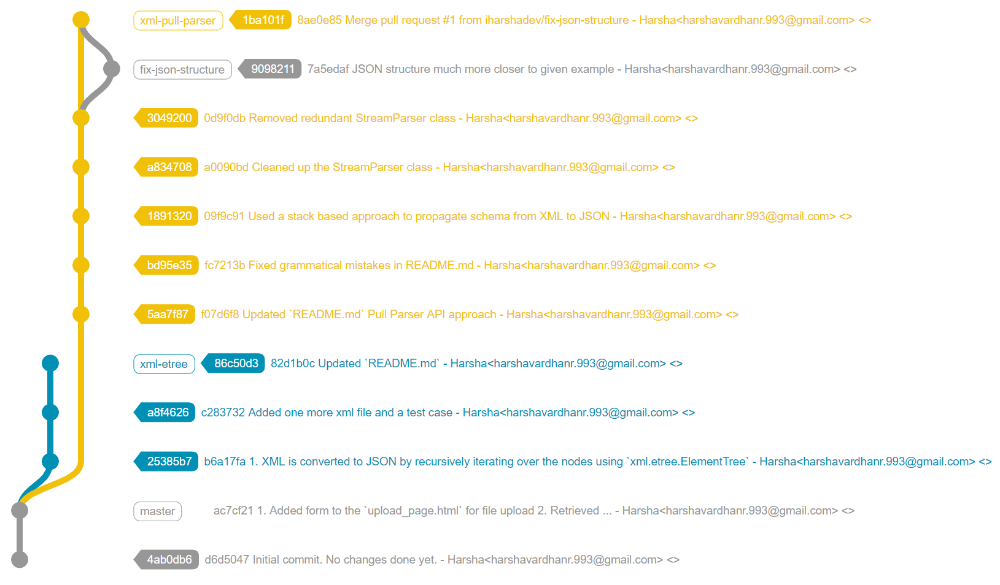

# Apollo Back-End Engineering Challenge

This challenge is designed to evaluate several things:
 - How well you know Python
 - How effectively you can work with the Django framework
 - How well you understand different data serialization formats, which is important for working with the diverse APIs Apollo integrates with
 - Your ability to work with connected Django pages
 - Your ability to work with Django Rest Framework
 
It is intended to take 2-4 hours. After you submit your solution (either by emailing us a .tar or .zip file, or uploading to GitHub), we will schedule a call to talk through your solution and how it could be extended to accomplish further goals.
 
## Setting Up

Install Python 3.7 or later if it is not already installed. Then, set up and enter a virtual environment and run `pip install -r requirements.txt` to install the dependencies. You should then be able to run the project from the `exercise` directory by running `python manage.py runserver`.

To verify that the server is running correctly, visit `http:127.0.0.1:8000` in your browser.

## Challenge Guidelines

This Django project consists of two parts:
1. A very simple HTML page at `/connected/`.
2. A stubbed out API endpoint at `/api/converter/convert/`

Your tasks are to:
1. Add a file input to the HTML page and modify the view so that, when a file is submitted, convert it to JSON and return that to the user
2. Add the same functionality to the API endpoint, returning the converted JSON as an `application/json` response.

To test your solution, you can run `python manage.py test`. This will execute 3 tests, which attempt to submit a file and check the response.

A good solution will not only pass the tests, but also work on any user-submitted XML file.

### JSON Conversion

For the purposes of this exercise, you may ignore any XML attributes. We are only interested in converting the XML node tags and any text values into JSON.

Leaf nodes should be converted into a JSON object with the node tag as the key and the node's text value as the value. For example, `<Foo>Bar</Foo>` should be converted to `{"Foo": "Bar"}`.

Non-leaf nodes should be converted into a JSON object with the node name as the key and an array of the node's children as the value. For example:
```
<Foo>
    <Bar>Baz</Bar>
</Foo>
```
should be converted to
```javascript
{
    "Foo": [
        {"Bar": "Baz"}
    ]
}
```

The tests provide additional examples of more complex conversions.

<h1 align="center">Solution (Submitted By: Harsha)</h1>

## Changes made
1. `/templates/upload_page.html` - Added a form with upload and submit button to upload the XML file.
2. `/static/styles.css` - Created the static directory for the css file. Imported this in the template html file by
slightly modifying `exercise/settings.py`
3. `/xml_converter/views.py` & `/xml_converter/api.py` - Added the method `traverse_recursive` to iterate over an 
XML file node wise and populate a dictionary object which can then be returned as an HTTPResponse with `application/json`
content type
## XML parsing
In this version of the solution, I've used Python's built in [xml.etree](https://docs.python.org/3/library/xml.etree.elementtree.html)
library ONLY to identify nodes. Rest of the logic has been implemented on my own. 

I've used the below algorithm/workflow/pseudocode to transform XML to JSON
```bash
Traverse(node)
    IF node IS leaf:
        return {Tag: Value}
    ELSE:
        // Recursively process children and add their returned values to a list
        children = []
        FOREACH child under node:
            children += Traverse(child)
        // return a JSON with first child's tag name in plural form as key and the list of processed children as value
``` 
## Important Observations/Notes
* As per the given examples, there is a special scenario involved with the `<Root>` tag as explained below
    1. When the `<Root>` tag has no children, the returned JSON should be `{"Root":""}`
    2. When the `<Root>` tag contains children, the `<Root>` tag is omitted in the JSON response

The first one is an edge case and has been handled in the `traverse_recursive()` method

* Serializing the Dictionary into a JSON response - This implementation does not use a Model to transform XML into JSON. 
Therefore `django.core.serializers` is not used as they are more suited to transform Models linked with database objects 

## Tests
This implementation passes all the test cases provided in the template as well as a few additional test cases added by me.

## Challenges
1. Understanding the usage of static files to style the html form - Django's documentation encourages `app` level templates.
Since this project had used project root level template, getting that to work took a fair bit of time.

2. Once the XML file is uploaded, the contents of the entire `InMemoryUploadedFile` is being read at once - This is not recommended
as per Django's [documentation](https://docs.djangoproject.com/en/3.1/ref/files/uploads/#django.core.files.uploadedfile.UploadedFile.read)
as any file larger than 2.5MB is recommended be read in multiple chunks (although this limit can be increased in the config)

## Git workflow
I've implemented the solution in two approaches each in their own branch which picture summarizes 

*Generated using [gitgraph-js](https://github.com/nicoespeon/gitgraph.js/tree/master/packages/gitgraph-js)*